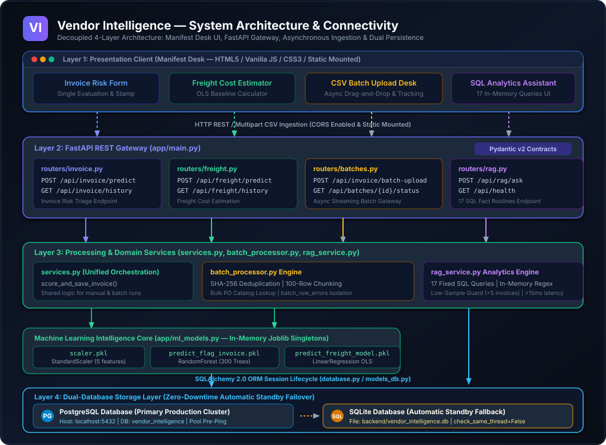
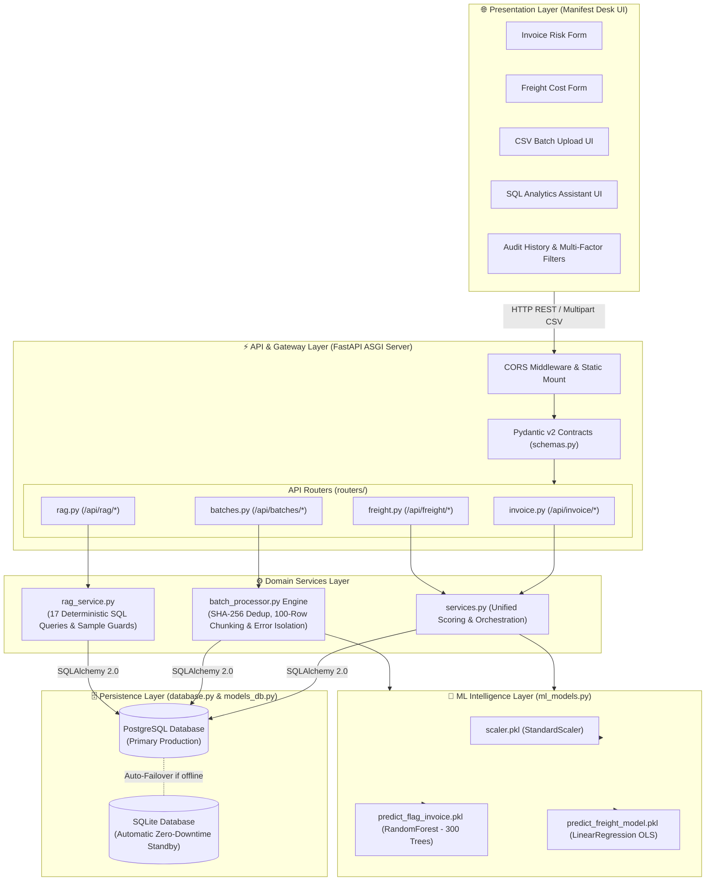
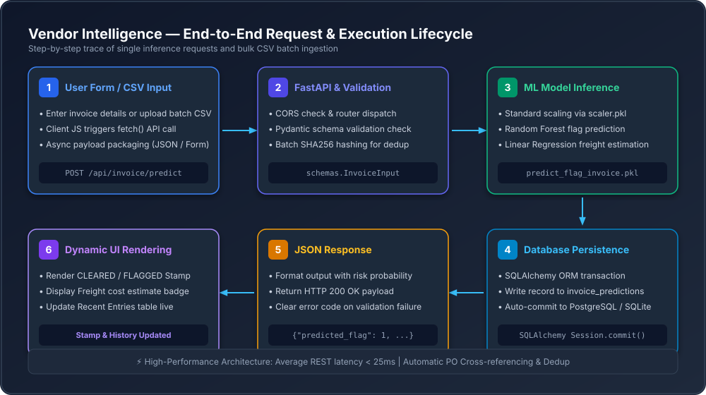
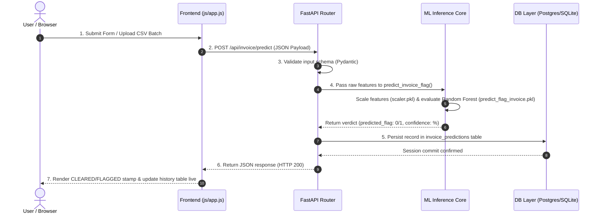
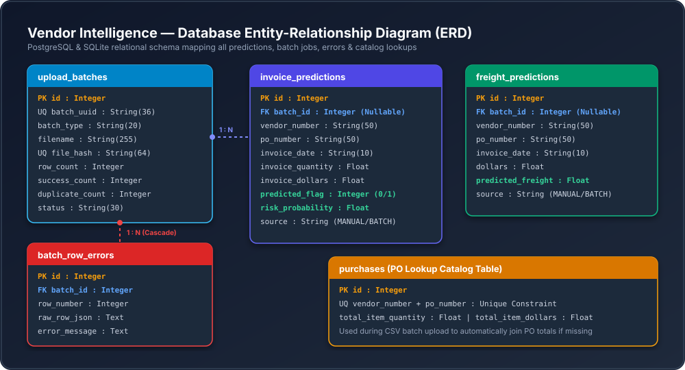
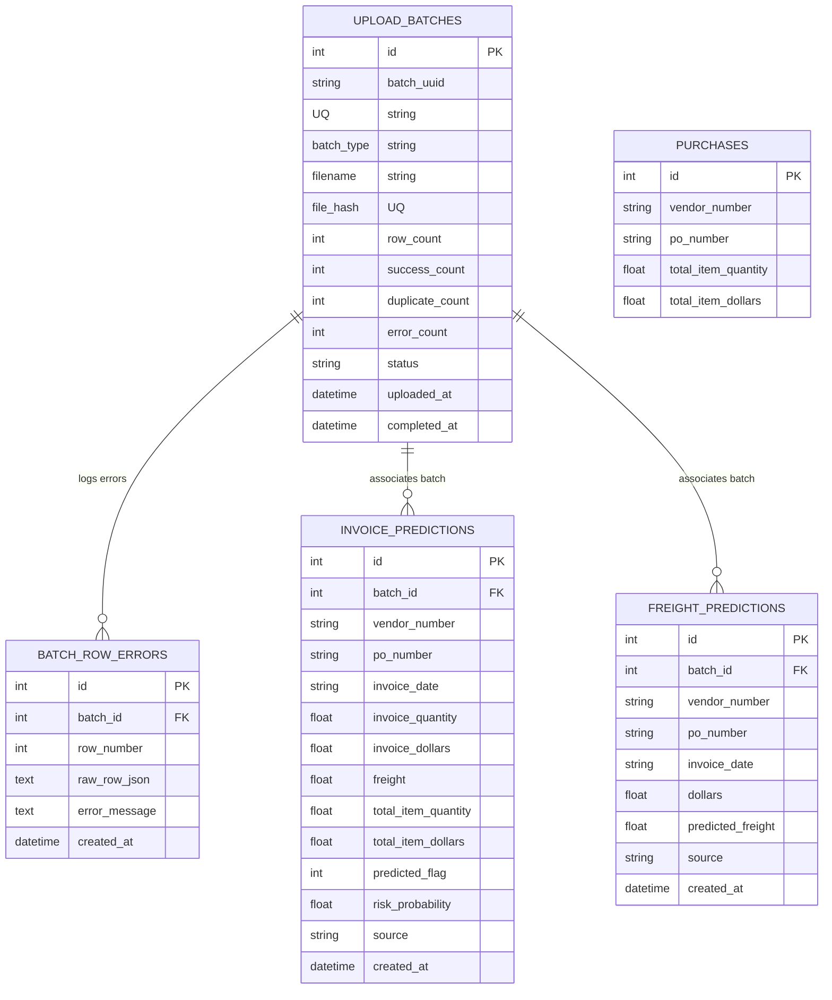
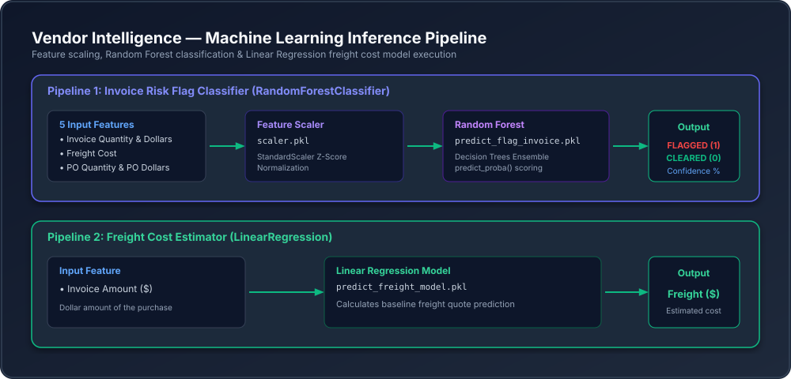

# Vendor Intelligence — System Architecture & Setup Guide


**Vendor Intelligence** is an enterprise-ready Machine Learning web application designed to evaluate **Invoice Risk** and project **Freight Costs** in real-time or in high-volume CSV batches. 

The system integrates trained Machine Learning models (`RandomForestClassifier` and `LinearRegression`) behind a robust **FastAPI** backend, complete with automated Pydantic schema validation, asynchronous batch CSV ingestion, deduplication hashing, RAG analytics support, and a resilient dual-database layer (PostgreSQL with automatic SQLite failover).

---

## 📊 System Architecture & Visualizations

To help developers, data scientists, and architects understand the project at a glance, this section provides visual representations of backend connectivity, request flows, database schema (ERD), and ML inference pipelines.

### 1. Backend Connectivity & System Architecture

The overall system architecture follows a decoupled 4-layer design (Presentation Client $\rightarrow$ FastAPI Microservices Gateway $\rightarrow$ Processing & Intelligence Core $\rightarrow$ Dual Database Storage Layer).

<p align="center">
  
</p>

<details>
<summary><b>View Native GitHub Mermaid Architecture Diagram</b></summary>


</details>

#### Key Connectivity Highlights:
- **Presentation Layer**: A lightweight Vanilla HTML5/JS/CSS single-page Manifest Desk served directly by FastAPI via `StaticFiles` mounting.
- **FastAPI API Gateway**: Implements modular routers (`routers/invoice.py`, `routers/freight.py`, `routers/batches.py`, `routers/rag.py`), strictly validating payloads using Pydantic v2 (`schemas.py`).
- **Domain Services & Batch Engine**: Shared business logic in `services.py`, streaming batch ingestion in `batch_processor.py` with whole-file SHA-256 deduplication and 100-row chunking, and an ultra-fast 17-query deterministic SQL analytics engine in `rag_service.py`.
- **Intelligence Core**: In-memory Joblib singletons in `ml_models.py` executing 300-tree Random Forest inference and OLS freight baselining in sub-2ms.
- **Resilient Dual Storage**: Connected via SQLAlchemy 2.0 ORM. If PostgreSQL is unbonded or unreachable, the system gracefully falls back to a local SQLite database (`vendor_intelligence.db`) without crashing.

---

### 2. End-to-End Request & Data Flow

This sequence illustrates how data moves from user action to ML inference, database transaction, and visual UI rendering.

<p align="center">
  
</p>

<details>
<summary><b>View Native GitHub Mermaid Sequence Diagram</b></summary>


</details>

#### Execution Lifecycles:
1. **Single Predictions**: Frontend sends `fetch()` POST request $\rightarrow$ Validated by Pydantic $\rightarrow$ Scaled via `scaler.pkl` $\rightarrow$ Scored by `predict_flag_invoice.pkl` or `predict_freight_model.pkl` $\rightarrow$ Saved to DB $\rightarrow$ Returned to browser in under 25ms.
2. **CSV Batch Scoring**: User uploads CSV file $\rightarrow$ SHA-256 hash computed for duplicate detection $\rightarrow$ Async processor cross-references Purchase Orders (`purchases` table) $\rightarrow$ Rows scored in parallel $\rightarrow$ Batch status (`PROCESSING`, `DONE`, `FAILED`) updated dynamically with per-row error logging.

---

### 3. Database Entity-Relationship Diagram (ERD)

The relational schema tracks all invoice and freight predictions, upload batch audit trails, granular row errors, and Purchase Order catalog lookups.

<p align="center">
  
</p>

<details>
<summary><b>View Native GitHub Mermaid ER Diagram</b></summary>


</details>

#### Schema Table Breakdown:
- **`upload_batches`**: Tracks uploaded CSV files, unique SHA256 hashes, status (`PROCESSING`, `DONE`, `FAILED`), and metrics.
- **`batch_row_errors`**: Stores line-by-line error tracebacks for failed rows in a batch without aborting valid rows.
- **`invoice_predictions`**: Stores input fields, binary anomaly flag (0 = Clear, 1 = Flagged), risk probability score, and source (`MANUAL` or `BATCH`).
- **`freight_predictions`**: Stores dollar amount, estimated freight cost, and prediction source.
- **`purchases`**: Catalog table used for bulk Purchase Order verification and metric auto-completion during CSV uploads.

---

### 4. Machine Learning Inference Pipeline

The ML pipeline incorporates feature preprocessing, scaling, and ensemble classification/regression.

<p align="center">
  
</p>

#### Model Details:
- **Invoice Risk Classifier**:
  - **Features**: `invoice_quantity`, `invoice_dollars`, `freight`, `total_item_quantity`, `total_item_dollars`.
  - **Preprocessing**: `StandardScaler` (`scaler.pkl`) normalizes numerical features.
  - **Model**: `RandomForestClassifier` (`predict_flag_invoice.pkl`) returns binary flag `0` (CLEARED) or `1` (FLAGGED) alongside probability $P(\text{risk})$.
- **Freight Cost Estimator**:
  - **Feature**: `dollars` (Total Invoice Amount).
  - **Model**: `LinearRegression` (`predict_freight_model.pkl`) predicts baseline expected shipping cost.

---

## 📁 1. Project Structure

```
vendor_intelligence/
├── backend/                     ← FastAPI Application (Python)
│   ├── app/
│   │   ├── main.py              ← Server entrypoint, router mounting & static files
│   │   ├── config.py            ← Environment settings & configuration loading
│   │   ├── database.py          ← SQLAlchemy engine with Postgres/SQLite failover
│   │   ├── models_db.py         ← Database ORM Table definitions
│   │   ├── schemas.py           ← Pydantic request/response data validation
│   │   ├── ml_models.py         ← Pretrained model loader & inference execution
│   │   ├── batch_processor.py   ← Async CSV parser, deduplication & PO matching engine
│   │   ├── rag_service.py       ← Natural language database query & analytics engine
│   │   └── routers/
│   │       ├── invoice.py       ← /api/invoice/... endpoints
│   │       ├── freight.py       ← /api/freight/... endpoints
│   │       ├── batches.py       ← /api/batches/... endpoints
│   │       └── rag.py           ← /api/rag/... endpoints
│   ├── models/                  ← Pretrained scikit-learn binary files (.pkl)
│   │   ├── scaler.pkl
│   │   ├── predict_flag_invoice.pkl
│   │   └── predict_freight_model.pkl
│   ├── requirements.txt
│   └── .env.example             ← Sample environment variables template
│
├── docs/                        ← Documentation & Architecture Visualizations
│   └── images/
│       ├── backend_connectivity.svg
│       ├── data_flow_sequence.svg
│       ├── database_erd.svg
│       └── ml_pipeline.svg
│
└── frontend/                    ← Web Interface (HTML5 / Vanilla JS / CSS3)
    ├── index.html               ← Responsive single-page application dashboard
    ├── css/style.css            ← Theme styling & stamp animations
    └── js/app.js                ← API fetch handler, state management & UI updates
```

---

## 🚀 2. Quickstart & Setup Guide

### Prerequisites
- **Python**: 3.9 or higher
- **PostgreSQL** *(Optional, auto-falls back to SQLite if not present)*

### Step 1: Database Setup (PostgreSQL)

If using PostgreSQL:
```bash
psql -U postgres
CREATE DATABASE vendor_intelligence;
\q
```
*Note: You do not need to create tables manually. SQLAlchemy automatically creates all tables on startup.*

### Step 2: Configure Environment Variables

```bash
cd backend
cp .env.example .env
```
Edit `.env` to set your database credentials:
```env
POSTGRES_USER=postgres
POSTGRES_PASSWORD=your_postgres_password
POSTGRES_HOST=localhost
POSTGRES_PORT=5432
POSTGRES_DB=vendor_intelligence
```

### Step 3: Install Dependencies and Launch Backend

```bash
cd backend

# Create & activate virtual environment
python -m venv venv

# Mac/Linux:
source venv/bin/activate
# Windows PowerShell:
venv\Scripts\activate

# Install requirements
pip install -r requirements.txt

# Start FastAPI server
uvicorn app.main:app --reload
```

The server will start at **http://127.0.0.1:8000**.

- **Interactive API Documentation**: Visit [http://localhost:8000/docs](http://localhost:8000/docs) (Swagger UI) to test endpoints directly.
- **Web Application Dashboard**: Visit [http://localhost:8000/](http://localhost:8000/) to access the web app.

---

## 💡 3. App Features & Usage

1. **Invoice Risk Check**:
   - Input Invoice Quantity, Invoice Dollars, Freight Cost, PO Quantity, and PO Dollars.
   - Receive an instant **CLEARED** or **FLAGGED** stamp with risk probability %.
2. **Freight Cost Estimate**:
   - Input invoice dollar amount to calculate projected shipping freight fees.
3. **CSV Batch Upload Engine**:
   - Drag-and-drop CSV files for bulk evaluation. Includes progress tracking, duplicate detection, and row-level error reporting.
4. **Interactive Audit History**:
   - Real-time prediction tables powered by PostgreSQL/SQLite persistence.

---

## ❓ 4. Common Troubleshooting

| Issue | Root Cause | Solution |
|---|---|---|
| DB Connection Error | Postgres service stopped or wrong credentials in `.env` | Verify Postgres service is running, or let the app automatically failover to local SQLite. |
| CORS Header Error | Origin mismatch when hosting frontend separately | Add frontend domain/port to `allowed_origins` in `backend/app/config.py`. |
| `ModuleNotFoundError` | Virtual environment not activated or missing packages | Run `venv\Scripts\activate` and execute `pip install -r requirements.txt`. |
| Model Loading Error | Missing `.pkl` files in `backend/models/` | Ensure `scaler.pkl`, `predict_flag_invoice.pkl`, and `predict_freight_model.pkl` exist inside `backend/models/`. |

---

## 📄 License & Maintainers

Maintained by **Smith Aherkar** — [vendor-update Repository](https://github.com/smithaherkar/vendor-update).
