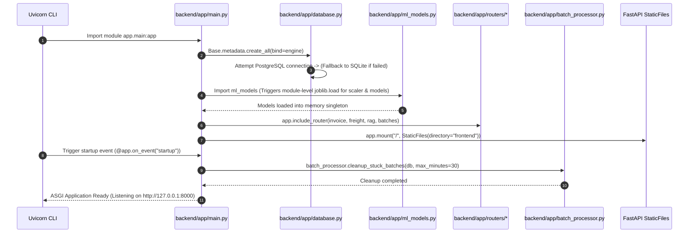
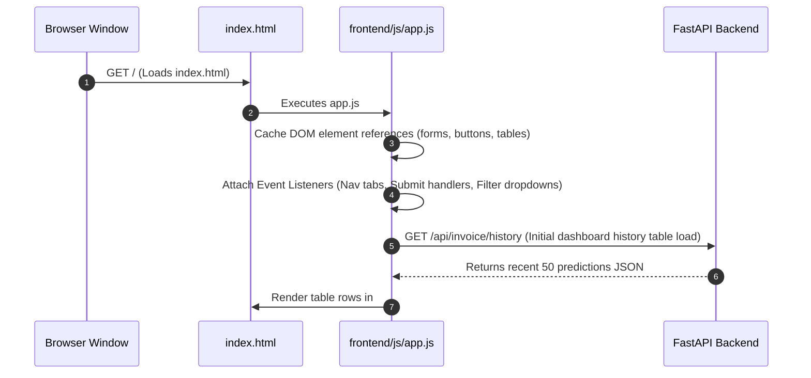
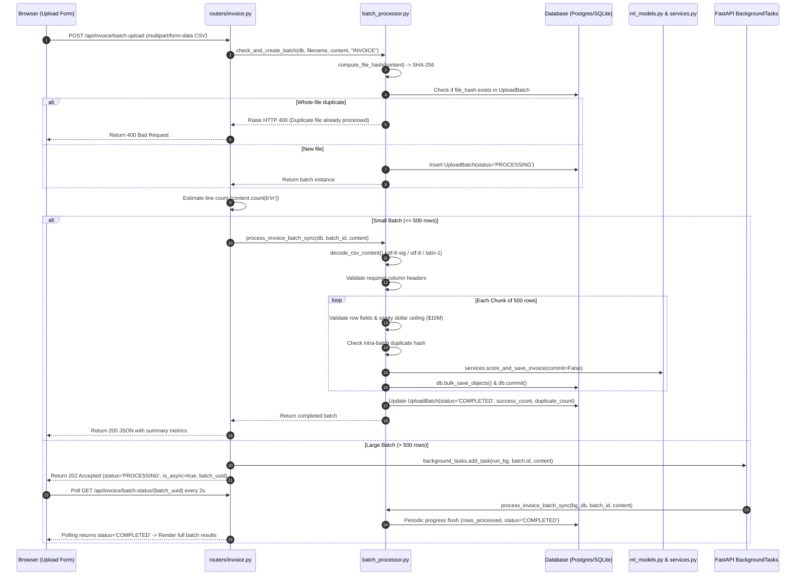
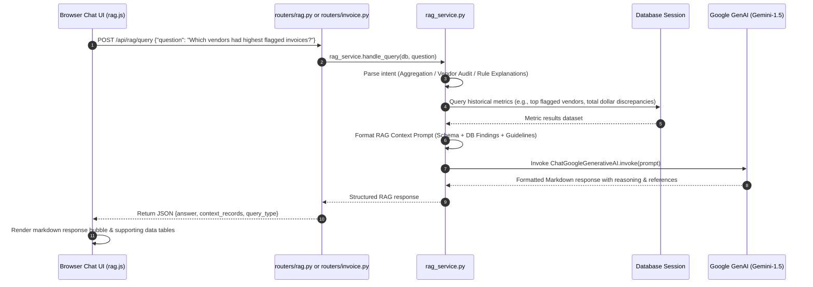
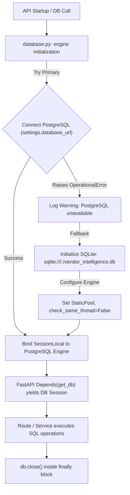

# End-to-End Code Execution & Control Flow Map (`flow.md`)

This document maps **how execution travels through files, functions, and modules** across the entire **Vendor Intelligence** system. It details the exact call sequences, execution orders, active execution paths, and an audit trail of all AI modifications made during sessions.

---

## 📑 Table of Contents

- [End-to-End Code Execution & Control Flow Map (`flow.md`)](#end-to-end-code-execution--control-flow-map-flowmd)
  - [📑 Table of Contents](#-table-of-contents)
  - [📍 Quick Reference: Active Modification Focal Point](#-quick-reference-active-modification-focal-point)
  - [🚀 System Bootstrapping & Entry Points](#-system-bootstrapping--entry-points)
    - [1. Backend Boot Sequence (`backend/app/main.py`)](#1-backend-boot-sequence-backendappmainpy)
    - [2. Frontend Client Initialization Sequence (`frontend/js/app.js`)](#2-frontend-client-initialization-sequence-frontendjsappjs)
  - [🔄 Detailed Function-to-Function Execution Flows](#-detailed-function-to-function-execution-flows)
    - [Flow 1: Single Invoice Risk Scoring (`POST /api/invoice/predict`)](#flow-1-single-invoice-risk-scoring-post-apiinvoicepredict)
    - [Flow 2: Freight Cost Estimation (`POST /api/freight/predict`)](#flow-2-freight-cost-estimation-post-apifreightpredict)
    - [Flow 3: CSV Batch Ingestion & Asynchronous Processing (`POST /api/invoice/batch-upload`)](#flow-3-csv-batch-ingestion--asynchronous-processing-post-apiinvoicebatch-upload)
    - [Flow 4: RAG Audit Explanation & Natural Language Assistant (`/api/rag/*`)](#flow-4-rag-audit-explanation--natural-language-assistant-apirag)
    - [Flow 5: Database Connection & Failover Lifecycle (`backend/app/database.py`)](#flow-5-database-connection--failover-lifecycle-backendappdatabasepy)
  - [🗺️ Module-to-Module Call Hierarchy Matrix](#️-module-to-module-call-hierarchy-matrix)
  - [📜 AI Session Change Ledger](#-ai-session-change-ledger)

---

## 📍 Quick Reference: Active Modification Focal Point
    
| Attribute | Current Value |
| :--- | :--- |
| **Active Session Target** | Documentation & Execution Architecture Mapping |
| **Current Target File** | [`flow.md`](file:///d:/newvendor/vendor-intelligence-main/flow.md) & [`decision.md`](file:///d:/newvendor/vendor-intelligence-main/decision.md) |
| **Affected Layer** | Documentation & Architecture Observability |
| **Execution Path Impacted** | Complete System Traceability (Presentation $\rightarrow$ Gateway $\rightarrow$ Service $\rightarrow$ ML $\rightarrow$ Persistence) |
| **Status** | In Progress (Documenting full execution flows & change history) |

---

## 🚀 System Bootstrapping & Entry Points

### 1. Backend Boot Sequence (`backend/app/main.py`)

When the backend is started via `uvicorn app.main:app --reload` or `python -m uvicorn`:



#### Detailed Step-by-Step Code Walkthrough:
1. **Module Import**: `uvicorn` imports [main.py](file:///d:/newvendor/vendor-intelligence-main/backend/app/main.py#L1-L23).
2. **Database Binding**: [main.py:16](file:///d:/newvendor/vendor-intelligence-main/backend/app/main.py#L16) calls `Base.metadata.create_all(bind=engine)`.
   - [database.py:24-34](file:///d:/newvendor/vendor-intelligence-main/backend/app/database.py#L24-L34) runs `create_engine()`. If PostgreSQL connection raises `OperationalError`, it falls back to SQLite `sqlite:///./vendor_intelligence.db`.
3. **ML Model Preloading**: Importing [ml_models.py:24-26](file:///d:/newvendor/vendor-intelligence-main/backend/app/ml_models.py#L24-L26) executes `joblib.load()` for:
   - `scaler.pkl` (`StandardScaler`)
   - `predict_flag_invoice.pkl` (`RandomForestClassifier`)
   - `predict_freight_model.pkl` (`LinearRegression`)
4. **Middleware & Routers**:
   - [main.py:36-42](file:///d:/newvendor/vendor-intelligence-main/backend/app/main.py#L36-L42) mounts `CORSMiddleware`.
   - [main.py:44-47](file:///d:/newvendor/vendor-intelligence-main/backend/app/main.py#L44-L47) includes `invoice.router`, `freight.router`, `rag.router`, `batches.router`.
5. **Startup Event**: [main.py:25-33](file:///d:/newvendor/vendor-intelligence-main/backend/app/main.py#L25-L33) `startup_event()` executes:
   - Calls [batch_processor.py:cleanup_stuck_batches](file:///d:/newvendor/vendor-intelligence-main/backend/app/batch_processor.py#L440-L468) to mark orphan jobs older than 30 mins as `FAILED`.

---

### 2. Frontend Client Initialization Sequence (`frontend/js/app.js`)

When a user opens `http://localhost:8000/` in the browser:



---

## 🔄 Detailed Function-to-Function Execution Flows

### Flow 1: Single Invoice Risk Scoring (`POST /api/invoice/predict`)

**Purpose**: User submits a single invoice through the web UI form or API client to detect fraud or risk.

```mermaid
flowchart TD
    A["👤 User Form Submit (index.html)"] -->|Event: submit| B["JS: invoiceForm handler (frontend/js/app.js)"]
    B -->|Fetch POST /api/invoice/predict| C["Router: predict_invoice() (backend/app/routers/invoice.py)"]
    C -->|Validate schema| D["Schema: schemas.InvoiceInput (backend/app/schemas.py)"]
    D -->|Call service| E["Service: services.score_and_save_invoice() (backend/app/services.py)"]
    E -->|Prepare 5-feature vector| F["ML: ml_models.predict_invoice_flag() (backend/app/ml_models.py)"]
    F -->|scaler.transform()| G["StandardScaler (scaler.pkl)"]
    G -->|flag_model.predict() & predict_proba()| H["RandomForestClassifier (predict_flag_invoice.pkl)"]
    H -->|Return (flag, prob)| F
    F -->|Return tuple| E
    E -->|Instantiate ORM & db.commit()| I["DB: models_db.InvoicePrediction (Postgres / SQLite)"]
    I -->|Return ORM instance| C
    C -->|Serialize response| J["Schema: schemas.InvoicePredictionOut"]
    J -->|JSON Response| B
    B -->|Render UI badge & probability bar| K["Browser DOM: #invoiceResult"]
```

#### Exact Step-by-Step Call Trace:
1. **Frontend**: [`frontend/js/app.js`](file:///d:/newvendor/vendor-intelligence-main/frontend/js/app.js) collects form inputs: `invoice_quantity`, `invoice_dollars`, `freight`, `total_item_quantity`, `total_item_dollars`, `vendor_number`, `po_number`, `invoice_date`.
2. **HTTP Request**: Dispatches `POST /api/invoice/predict` with JSON body.
3. **Gateway Router**: [`backend/app/routers/invoice.py:predict_invoice`](file:///d:/newvendor/vendor-intelligence-main/backend/app/routers/invoice.py#L12-L41) receives request.
4. **Validation**: Pydantic validates input via [`schemas.InvoiceInput`](file:///d:/newvendor/vendor-intelligence-main/backend/app/schemas.py).
5. **Business Service**: Calls [`services.score_and_save_invoice`](file:///d:/newvendor/vendor-intelligence-main/backend/app/services.py#L10-L63).
6. **ML Inference**:
   - Calls [`ml_models.predict_invoice_flag`](file:///d:/newvendor/vendor-intelligence-main/backend/app/ml_models.py#L29-L41).
   - Formats Pandas DataFrame with `FLAG_FEATURE_ORDER` = `["invoice_quantity", "invoice_dollars", "Freight", "total_item_quantity", "total_item_dollars"]`.
   - Executes `scaler.transform(row)`.
   - Executes `flag_model.predict(row_scaled)` and `flag_model.predict_proba(row_scaled)`.
7. **Database Persistence**: Instantiates [`models_db.InvoicePrediction`](file:///d:/newvendor/vendor-intelligence-main/backend/app/models_db.py), calls `db.add(record)`, `db.commit()`, `db.refresh(record)`.
8. **Response Formatting**: Returns [`schemas.InvoicePredictionOut`](file:///d:/newvendor/vendor-intelligence-main/backend/app/schemas.py) with `risk_label` (`FLAGGED` or `CLEARED`) and `risk_probability`.
9. **UI Update**: `app.js` renders badge, score meter, and appends the new record to the history table.

---

### Flow 2: Freight Cost Estimation (`POST /api/freight/predict`)

**Purpose**: User submits invoice dollar amount to estimate freight cost.

```mermaid
flowchart TD
    A["👤 User Form Submit (index.html)"] -->|Event: submit| B["JS: freightForm handler (frontend/js/app.js)"]
    B -->|Fetch POST /api/freight/predict| C["Router: predict_freight() (backend/app/routers/freight.py)"]
    C -->|Validate schema| D["Schema: schemas.FreightInput (backend/app/schemas.py)"]
    D -->|Call service| E["Service: services.score_and_save_freight() (backend/app/services.py)"]
    E -->|Call ML pipeline| F["ML: ml_models.predict_freight() (backend/app/ml_models.py)"]
    F -->|freight_model.predict(Dollars)| G["LinearRegression (predict_freight_model.pkl)"]
    G -->|Raw estimate| F
    F -->|Clamp: max(0.0, min(raw, dollars))| E
    E -->|db.add & db.commit()| H["DB: models_db.FreightPrediction (Postgres / SQLite)"]
    H -->|Return ORM instance| C
    C -->|Serialize response| I["Schema: schemas.FreightPredictionOut"]
    I -->|JSON Response| B
    B -->|Display estimated freight & ratio| J["Browser DOM: #freightResult"]
```

#### Exact Step-by-Step Call Trace:
1. **Frontend**: [`frontend/js/app.js`](file:///d:/newvendor/vendor-intelligence-main/frontend/js/app.js) sends `dollars` (and optional metadata `vendor_number`, `po_number`, `invoice_date`).
2. **HTTP Request**: `POST /api/freight/predict`.
3. **Router**: [`backend/app/routers/freight.py:predict_freight`](file:///d:/newvendor/vendor-intelligence-main/backend/app/routers/freight.py).
4. **Service**: [`services.score_and_save_freight`](file:///d:/newvendor/vendor-intelligence-main/backend/app/services.py#L66-L97).
5. **ML Inference**: [`ml_models.predict_freight`](file:///d:/newvendor/vendor-intelligence-main/backend/app/ml_models.py#L44-L57):
   - Executes linear regression prediction.
   - Applies safety clamp: `max(0.0, min(raw, dollars))` to prevent negative freight or freight exceeding total invoice value.
6. **Persistence**: Saves [`models_db.FreightPrediction`](file:///d:/newvendor/vendor-intelligence-main/backend/app/models_db.py) to database.
7. **Response**: Returns [`schemas.FreightPredictionOut`](file:///d:/newvendor/vendor-intelligence-main/backend/app/schemas.py).

---

### Flow 3: CSV Batch Ingestion & Asynchronous Processing (`POST /api/invoice/batch-upload`)

**Purpose**: High-volume ingestion of multi-thousand row CSV files with deduplication, validation, ML scoring, and progress tracking.



---

### Flow 4: RAG Audit Explanation & Natural Language Assistant (`/api/rag/*`)

**Purpose**: AI-assisted anomaly audit explanation (`/api/invoice/{id}/explain`) and natural language conversational querying (`POST /api/rag/query`).



---

### Flow 5: Database Connection & Failover Lifecycle (`backend/app/database.py`)

**Purpose**: Handles primary connection to PostgreSQL with zero-downtime automatic fallback to SQLite.



---

## 🗺️ Module-to-Module Call Hierarchy Matrix

| Caller Module | Called Function / Class | Target File | Purpose |
| :--- | :--- | :--- | :--- |
| `main.py` | `Base.metadata.create_all()` | [`database.py`](file:///d:/newvendor/vendor-intelligence-main/backend/app/database.py) | Initialize DB schema |
| `main.py` | `cleanup_stuck_batches()` | [`batch_processor.py`](file:///d:/newvendor/vendor-intelligence-main/backend/app/batch_processor.py) | Recover orphaned batch jobs on startup |
| `main.py` | `include_router()` | [`routers/*.py`](file:///d:/newvendor/vendor-intelligence-main/backend/app/routers) | Register REST API endpoints |
| `routers/invoice.py` | `score_and_save_invoice()` | [`services.py`](file:///d:/newvendor/vendor-intelligence-main/backend/app/services.py) | Single invoice risk scoring & DB save |
| `routers/invoice.py` | `check_and_create_batch()` | [`batch_processor.py`](file:///d:/newvendor/vendor-intelligence-main/backend/app/batch_processor.py) | Validate and track CSV batch |
| `routers/invoice.py` | `explain_invoice_flag()` | [`rag_service.py`](file:///d:/newvendor/vendor-intelligence-main/backend/app/rag_service.py) | Generate Gemini RAG audit explanation |
| `routers/freight.py` | `score_and_save_freight()` | [`services.py`](file:///d:/newvendor/vendor-intelligence-main/backend/app/services.py) | Single freight cost estimation |
| `routers/rag.py` | `handle_query()` | [`rag_service.py`](file:///d:/newvendor/vendor-intelligence-main/backend/app/rag_service.py) | Natural language queries & RAG analytics |
| `services.py` | `predict_invoice_flag()` | [`ml_models.py`](file:///d:/newvendor/vendor-intelligence-main/backend/app/ml_models.py) | Scikit-Learn scaler + RandomForest |
| `services.py` | `predict_freight()` | [`ml_models.py`](file:///d:/newvendor/vendor-intelligence-main/backend/app/ml_models.py) | LinearRegression freight model |
| `batch_processor.py` | `score_and_save_invoice()` | [`services.py`](file:///d:/newvendor/vendor-intelligence-main/backend/app/services.py) | Reusable scoring for batch rows |

---

## 📜 AI Session Change Ledger

This ledger tracks **every code modification performed by the AI agent** in chronological order, recording the exact path, functions, and rationale.

### Session Log Index

| Change ID | Timestamp | Target File(s) | Functions / Components Touched | Description of Changes |
| :--- | :--- | :--- | :--- | :--- |
| **CHG-0001** | 2026-09-12 13:19 | [`decision.md`](file:///d:/newvendor/vendor-intelligence-main/decision.md) | Whole file (New) | Created Architecture & Design Decision Log (`decision.md`) with ADR-0001 to ADR-0008, template, and logging guidelines. |
| **CHG-0002** | 2026-09-12 13:33 | [`flow.md`](file:///d:/newvendor/vendor-intelligence-main/flow.md) | Whole file (New) | Created Execution Flow & Call Graph Map (`flow.md`) documenting complete entry points, execution chains, Mermaid sequence diagrams, and active modification tracking. |

---

### Change Detail Records

#### CHG-0001: Architecture Decision Record Log Initialization
- **Timestamp**: 2026-09-12 13:19:06 IST
- **Target File**: [`d:/newvendor/vendor-intelligence-main/decision.md`](file:///d:/newvendor/vendor-intelligence-main/decision.md)
- **Component**: Project Architecture & Documentation
- **What was changed**:
  - Implemented formal ADR framework with standard template.
  - Documented ADR-0001 through ADR-0008 covering FastAPI, PostgreSQL/SQLite Dual Engine, Joblib serialization, SHA-256 deduplication, Vanilla JS frontend, LangChain GenAI, Layered architecture, and Pydantic v2 validation.
- **Execution Path Affected**: System-wide architectural documentation.

#### CHG-0002: Execution Flow & Control Flow Mapping
- **Timestamp**: 2026-09-12 13:33:40 IST
- **Target File**: [`d:/newvendor/vendor-intelligence-main/flow.md`](file:///d:/newvendor/vendor-intelligence-main/flow.md)
- **Component**: Execution Flow Observability & Call Tree Documentation
- **What was changed**:
  - Documented backend startup sequence ([`backend/app/main.py`](file:///d:/newvendor/vendor-intelligence-main/backend/app/main.py)).
  - Documented frontend client initialization ([`frontend/js/app.js`](file:///d:/newvendor/vendor-intelligence-main/frontend/js/app.js)).
  - Detailed function-by-function execution flows for Invoice Scoring, Freight Estimation, Batch Uploads, RAG Assistant, and Database Failover.
  - Added module call hierarchy matrix and AI session change ledger.
- **Execution Path Affected**: Observability across all backend and frontend execution paths.
